CUDA Path Tracer
================

**University of Pennsylvania, CIS 5650: GPU Programming and Architecture, Project 3**

* Shanshan Wu
* Tested on: Windows 11, AMD Ryzen 9 270 @ ~4.0GHz, 32GB RAM, NVIDIA GeForce RTX 5070 Laptop GPU (personal laptop)

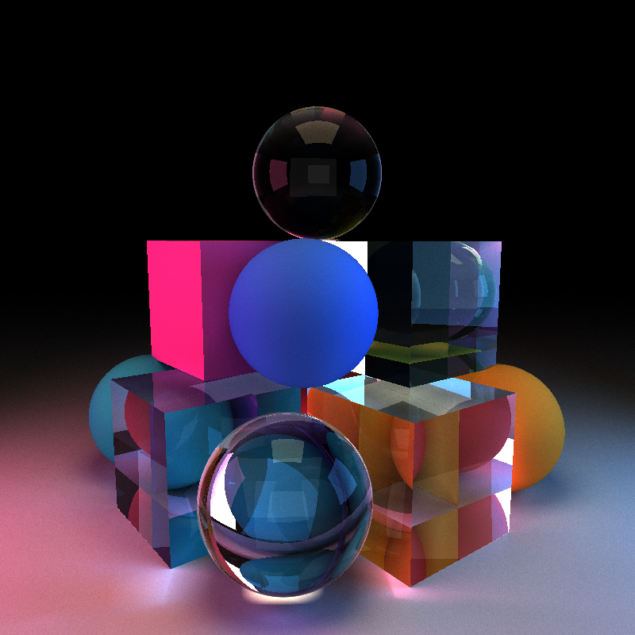

*`scenes/glass_pyramid.json`: a pyramid of glass (IOR 1.5) and diffuse spheres and cubes, lit by coloured area lights outside the frame. 800 x 800, 5000 samples, trace depth 16.*


## Features

| Rendering | Sampling | Performance |
|---|---|---|
| Diffuse BSDF with cosine-weighted sampling | Stochastic antialiasing | Stream-compacted path termination |
| Refraction with Schlick Fresnel | Stratified (jittered) pixel and lens samples | Material sorting (toggleable) |
| Thin-lens depth of field | Direct lighting on the final ray | Russian roulette |

Every feature can be switched on and off with a macro at the top of `src/pathtrace.cu`:

| Macro | Controls |
|---|---|
| `ANTIALIASING` | Sub-pixel jitter |
| `STREAM_COMPACTION` | Removing terminated paths after each bounce |
| `SORT_MAT` | Sorting paths by material before shading |
| `RUSSIAN_ROULETTE`, `RUSSIAN_ROULETTE_DEPTH` | Probabilistic termination and the bounce it starts at |
| `BETTER_SAMPLING`, `GRID_SIZE` | Stratified sampling and the number of strata per axis |
| `DIRECT_LIGHTING`, `DIRECT_LIGHTING_MAX_WEIGHT` | Light sampling on the final ray and its clamp |

Depth of field is controlled per scene: an `APERTURE` of 0 gives a pinhole camera.

## Core pipeline

### Diffuse shading

Each bounce, a path multiplies its throughput by the surface albedo and continues in a cosine-weighted random direction. With cosine-weighted sampling the BRDF, the cosine term and the pdf cancel, so the update is a single multiply. A path ends when it reaches a light (throughput times emittance is its contribution), leaves the scene, or runs out of bounces (no contribution).

The result matches the reference render to within one grey level at five sample locations.

| Reference | This renderer, 5000 samples |
|---|---|
|  |  |

### Antialiasing

Each iteration offsets the camera ray by a random position inside the pixel, so a pixel straddling an edge converges to the area-weighted mix of both sides instead of a hard step. See [stratified sampling](#stratified-sampling) for the improved version.

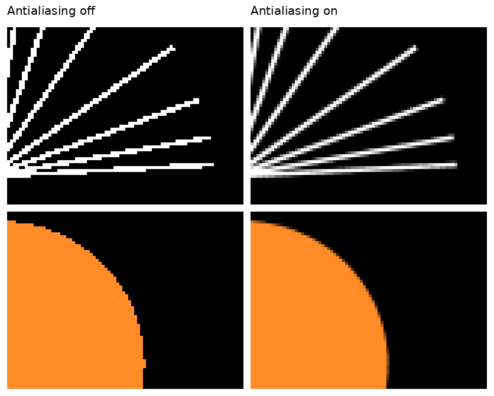

*Crops of a test scene (`scenes/aa_test.json`) enlarged 5x without filtering. *

### Stream compaction

After shading, `thrust::partition` moves live paths to the front of the array and the next bounce launches only that many threads. Terminated paths stay in the tail of the array, because their colour is still needed by the final gather.

*GPU vs CPU:* a CPU tracer follows one path to completion and never has dead entries to skip. Compaction is a cost the GPU pays to keep warps full. In the scenes tested here that cost was larger than the saving; see [performance analysis](#performance-analysis).

*Further work:* compact only when the live fraction drops below a threshold, since the partition is wasted in the first bounce or two.

### Material sorting

Before shading, paths are sorted by the material they hit (`thrust::sort_by_key`, keyed on the intersection record, with the path segments as values) so threads in the same warp run the same BSDF branch.

In these scenes it makes rendering slower. There are only a handful of materials and almost all of them are diffuse, so there is little divergence to remove, while the sort itself moves two full structs per path. It should start to pay off with many materials whose BSDFs differ a lot in cost.


## Additional features

### Refraction

Refractive materials use Snell's law (`glm::refract`) with Schlick's approximation for the Fresnel reflectance. Each hit picks reflection or refraction with probability equal to the reflectance. Total internal reflection is detected from Snell's law before refracting. Whether a ray is entering or leaving the object is carried from the intersection test into the shading kernel, and the new ray origin is offset to the side of the surface the ray continues on.

| Diffuse sphere | Glass sphere, IOR 1.5 |
|---|---|
|  | 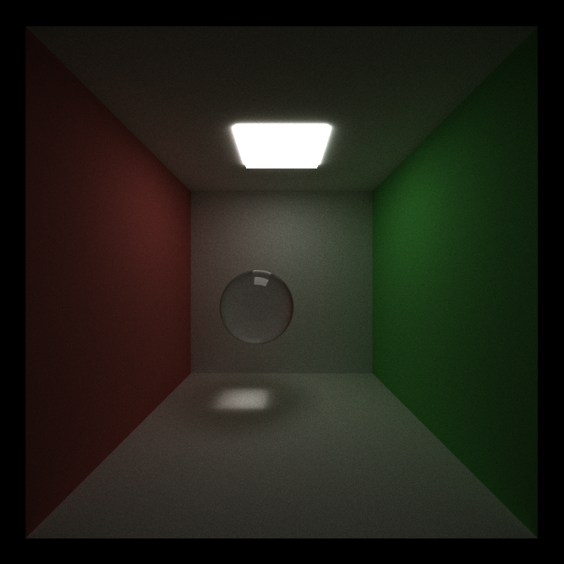 |

*Performance:* the refractive branch is a few extra arithmetic operations per hit. Glass does keep paths alive longer, so scenes with glass need a higher trace depth.

*GPU vs CPU:* on the GPU the reflect/refract choice is a data-dependent branch inside a warp; a CPU tracer has no such penalty.


### Depth of field

A thin-lens camera. The pinhole ray for a pixel is intersected with the focal plane to find the focus point; the ray origin is then moved to a uniformly sampled point on the lens disk and re-aimed at that point. Objects on the focal plane stay sharp, everything else blurs in proportion to the aperture and its distance from the plane.

| Pinhole | Aperture 1, focused on the sphere only |
|---|---|
|  | 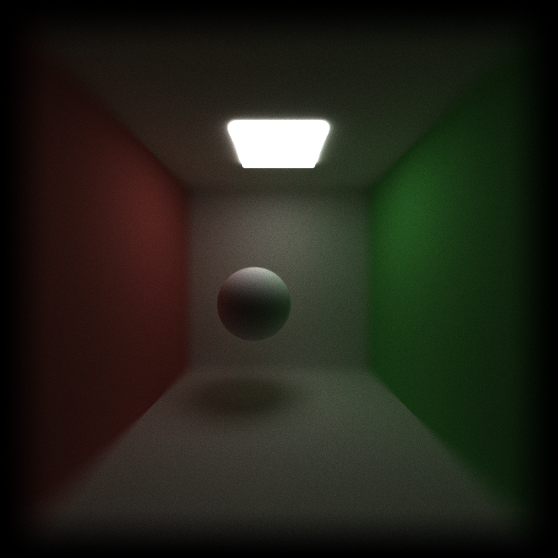 |

*Performance:* a handful of operations in the ray generation kernel, no measurable cost per frame.

*GPU vs CPU:* identical work on either; it parallelises trivially because every pixel is independent.


### Stratified sampling

Pure random samples clump. Here the pixel area and the lens disk are each divided into a `GRID_SIZE` x `GRID_SIZE` grid, and consecutive iterations visit every cell exactly once in a per-pixel shuffled order (an affine permutation seeded by a hash of the pixel and the pass). The pixel and lens dimensions use different permutations so they are not correlated.

*Effect:* smoother edges and less grainy defocus blur at low sample counts. It does not reduce noise from indirect lighting, which dominates in these scenes.

*GPU vs CPU:* the cell index is computed from the iteration number and a hash, with no shared state, so it costs the same on both.


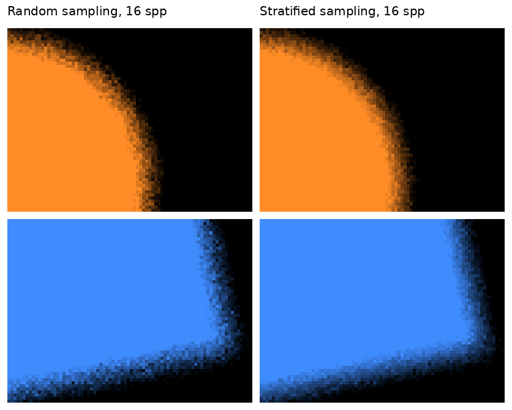

*Defocused edges in `scenes/aa_test.json` (aperture 0.3) after 16 samples, enlarged 5x without filtering. With stratification the blurred edge is a smooth gradient; with random samples it is speckled.*

In the Cornell box the same comparison at 16 samples shows no visible difference: the image is dominated by noise from indirect lighting, which stratifying the pixel and lens samples does not touch.

### Direct lighting

The final ray of each path is aimed at a uniformly sampled point on an emissive cube instead of a BSDF-sampled direction, weighted by the area-to-solid-angle conversion. Occlusion needs no extra code: the ray goes through the normal intersection pass, and if it hits anything other than the light the path ends with no contribution. It applies to diffuse surfaces only.

Because only the final ray changes, the effect is largest at low trace depths.

The weight is clamped (`DIRECT_LIGHTING_MAX_WEIGHT`). Without the clamp, a final vertex lying within a few centimetres of the light makes the 1/d² term explode and leaves isolated white pixels anywhere in the image. The clamp introduces a small bias confined to a narrow band around the light.

| Before clamping (fireflies) | After clamping |
|---|---|
|  | 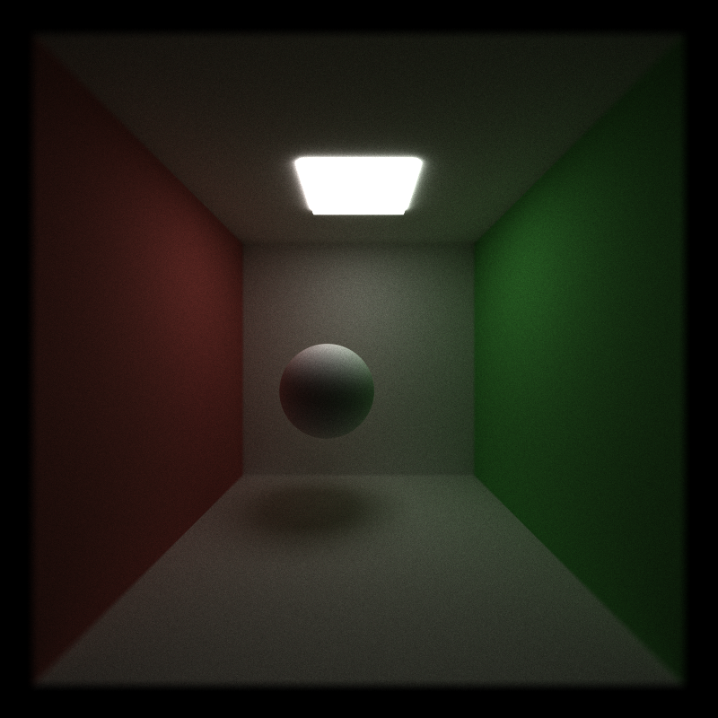 |

*GPU vs CPU:* the same computation, but on the GPU the light sample reuses the existing wavefront — no separate shadow-ray kernel is launched.

*Further work:* next event estimation at every bounce with multiple importance sampling, and support for spherical lights.

At trace depth 2 the final ray is half of every path, which makes the effect easy to see. Both images are 200 samples:

| BSDF sampling only | Direct lighting on the final ray |
|---|---|
| 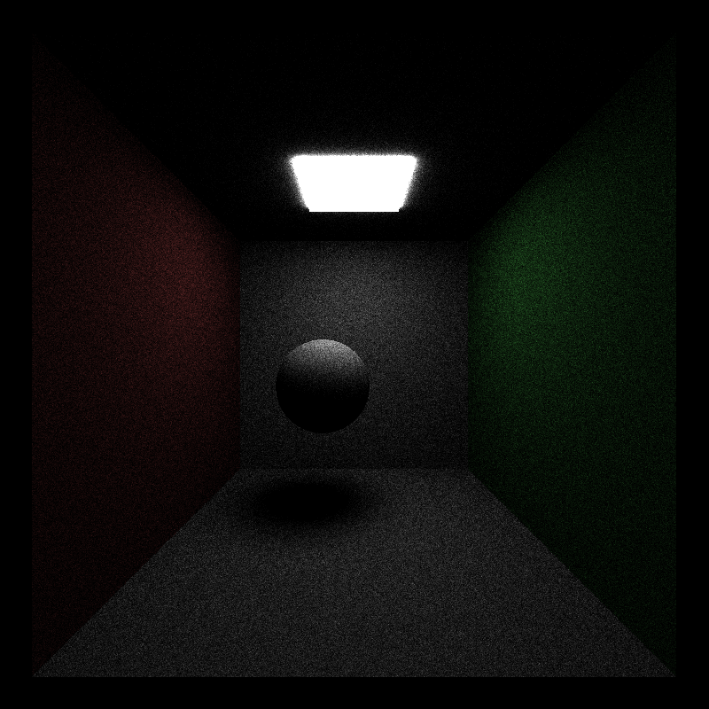 | 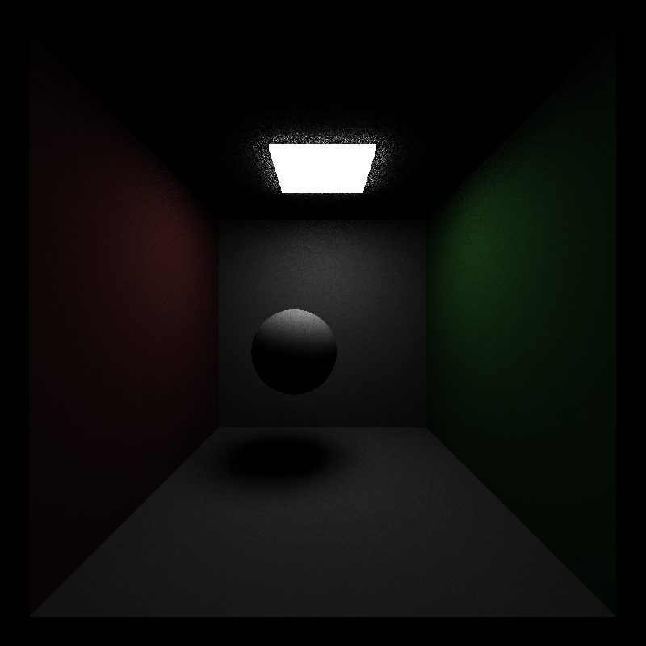 |

The two images have the same average brightness (measured on the floor, the back wall and both side walls, they agree to within one grey level), but the pixel noise on the floor is 4.3 times lower with direct lighting. Since noise falls with the square root of the sample count, the BSDF-sampled image would need roughly 18 times as many samples to look as clean. The speckles on the ceiling next to the light are the region where the weight is clamped.

### Russian roulette

From the fourth bounce on, a path survives with probability equal to the largest component of its throughput, and survivors are divided by that probability so the expected value is unchanged. Dim paths that would contribute almost nothing are dropped early. Brightness matches the reference with it enabled.

*GPU vs CPU:* on a CPU a terminated path simply stops costing anything. On the GPU the saving only materialises together with stream compaction, which is what actually removes the terminated paths from later kernel launches.

*Further work:* use luminance-weighted throughput and a minimum termination probability, as PBRT does.

## Performance analysis

All timings are for 800 x 800, Release build, trace depth 8, read from the ms/frame counter after it settles. Unless stated otherwise: pinhole camera, with antialiasing, material sorting, stratified sampling and direct lighting off.

### Stream compaction

Live paths entering each bounce (iteration 10):

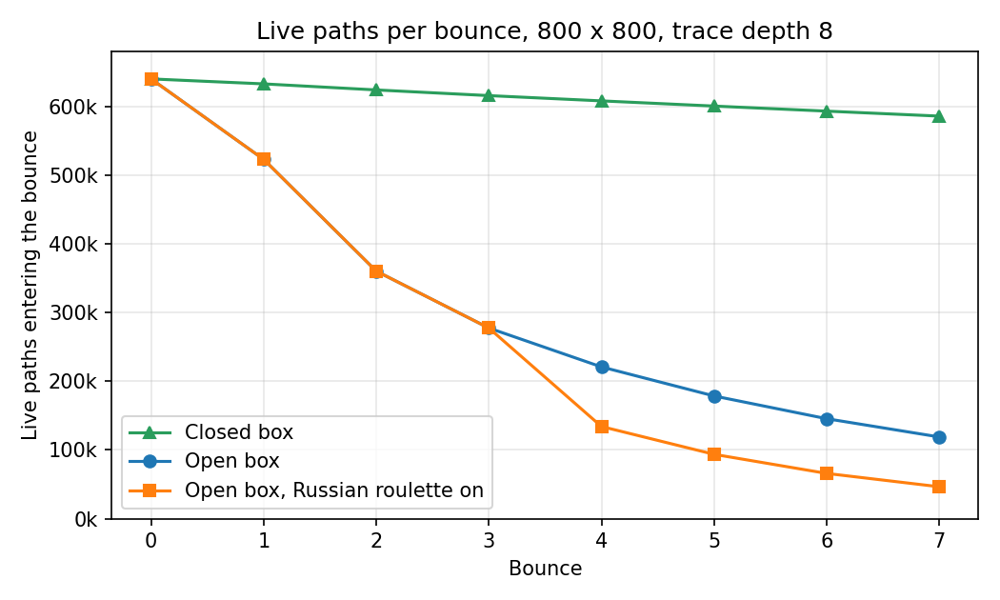

| Bounce | 0 | 1 | 2 | 3 | 4 | 5 | 6 | 7 |
|---|---|---|---|---|---|---|---|---|
| Open box | 640,000 | 522,857 | 360,262 | 277,443 | 220,858 | 178,573 | 145,481 | 118,927 |
| Open box, Russian roulette on | 640,000 | 522,857 | 360,262 | 277,443 | 134,129 | 93,630 | 65,845 | 46,437 |
| Closed box | 640,000 | 632,771 | 623,960 | 615,704 | 608,027 | 600,483 | 593,124 | 585,874 |

In the open box paths leave through the front opening or hit the light, so by the last bounce only 19% of them are still alive. Over a whole iteration compaction launches 2.46 million path-bounces instead of 5.12 million, a 52% reduction. The benefit grows with depth: the first bounce still runs 82% of the paths, the last one 19%.

In the closed box no ray can escape. A path only ends by reaching the light, which removes about 1% per bounce, so 92% are still alive at the last bounce and compaction removes just 4% of the path-bounces.

| Scene | Compaction off (ms/frame) | Compaction on (ms/frame) |
|---|---|---|
| Open Cornell box | 17 | 20 |
| Closed box | 20 | 33 |

Despite halving the work in the open box, compaction made both scenes slower. Two reasons:

* A terminated path is cheap without compaction. The shading kernel returns on its first line when `remainingBounces` is 0, and the intersection kernel only has 8 primitives to test, so a dead thread costs very little. Compaction removes threads that were doing almost no work.
* `thrust::partition` is expensive. It runs once per bounce over an array of full `PathSegment` structs, and each call moves a large part of that array. With so few primitives the intersection kernel is cheap enough that the partition costs more than the bounce it is trying to shorten.

The closed box makes this worse: the partition has almost nothing to remove, yet it still pays the full price of rearranging 600,000 structs every bounce. That is why the penalty grows from 3 ms to 13 ms.

Compaction should start paying off when a single bounce is expensive (many primitives, no acceleration structure) and many paths die early.

### Material sorting

| Sorting off (ms/frame) | Sorting on (ms/frame) |
|---|---|
| 20 | 44 |

Sorting more than doubles the frame time. The scene has five materials and four of them are diffuse, so there is almost no branch divergence to remove, while `thrust::sort_by_key` moves an intersection record and a path segment per path on every bounce.

### Russian roulette

Stream compaction on in both columns.

| Scene | Off (ms/frame) | On (ms/frame) |
|---|---|---|
| Open Cornell box | 20 | 20 |
| Closed box | 33 | 29 |

In the open box Russian roulette removes 39% of the paths at bounce 4 and 61% by bounce 7 (table above), but the frame time does not move. It only acts on the last four bounces, which were already the cheapest ones: the total number of path-bounces drops by 13%, and the saving is below the resolution of the frame counter.

In the closed box it is 12% faster. There, without Russian roulette nearly every path survives to the final bounce, so roulette is the only thing shrinking the array and it gives compaction something to remove.

### Other features

Open Cornell box, stream compaction and Russian roulette on. Each row changes one thing relative to the 20 ms baseline.

| Feature | Off (ms/frame) | On (ms/frame) |
|---|---|---|
| Depth of field (aperture 1.0) | 20 | 17 |
| Refraction (glass sphere instead of diffuse) | 20 | 19 |
| Stratified sampling (with antialiasing, which it requires) | 20 | 17.5 |
| Direct lighting | 20 | 18 |

None of these features has a measurable cost. Each adds a few arithmetic operations to one kernel, and the differences of 1 to 3 ms are within the run-to-run variation of the frame counter, so they should not be read as speedups.

Direct lighting does change the path counts: the number of paths entering the last bounce drops from 46,437 to 20,850, because a final ray aimed at the light usually reaches it and terminates.

## Bloopers

| | |
|---|---|
| 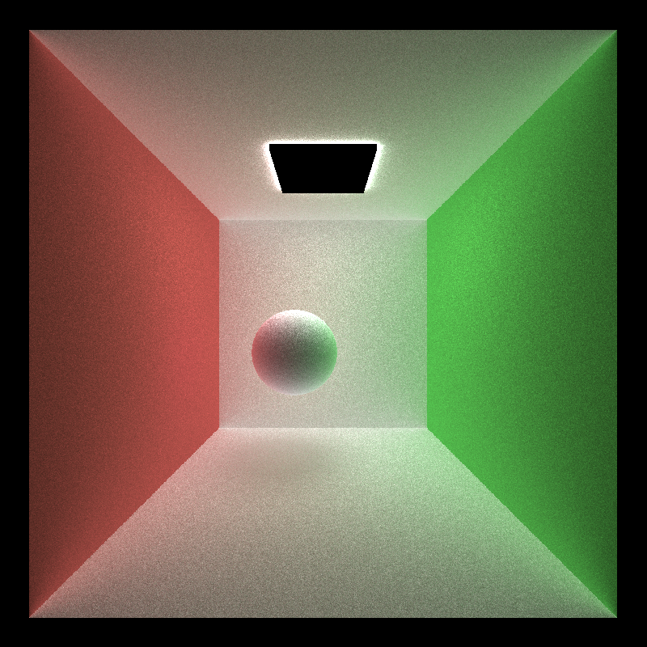 | 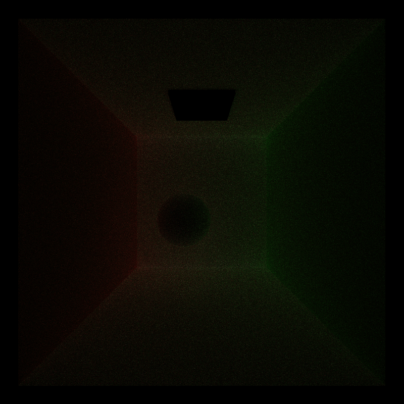 |
| **Black light, washed-out walls.** The loop stopped after two bounces, and paths that never reached the light were still added to the image with their leftover throughput. Meanwhile paths that *had* reached the light were being zeroed on the following bounce. | **Almost black.** Every terminated path was zeroed at the top of the shading kernel, including the ones that ended by hitting the light. Only paths that reached the light on the very last bounce survived. |

## Scene file changes

Two additions to the JSON scene format:

```json
"Camera": {
    "APERTURE": 0.5,
    "FOCALLENGTH": 10.5
}
```

`APERTURE` is the lens radius (0 or absent gives a pinhole camera). `FOCALLENGTH` is the distance from the camera to the focal plane along the view direction.

```json
"glass": {
    "TYPE": "Refractive",
    "RGB": [1.0, 1.0, 1.0],
    "IOR": 1.5
}
```

## Build notes

`CMakeLists.txt` was modified: `/Zc:preprocessor` is passed to MSVC for both CUDA and C++ sources. CUDA 13's CCCL headers refuse to compile with MSVC's traditional preprocessor.

## References

* [Physically Based Rendering, 4th ed.](https://pbr-book.org/4ed/contents) — 5.2.3 thin lens model, 9.2 diffuse reflection, 9.3 specular reflection and transmission
* [Physically Based Rendering, 3rd ed.](https://www.pbr-book.org/3ed-2018/contents) — 13.7 Russian roulette
* [Schlick's approximation](https://en.wikipedia.org/wiki/Schlick's_approximation)
* Paul Bourke, [Antialiasing and Raytracing](https://paulbourke.net/miscellaneous/raytracing/)
* [UCSD CSE 168 notes on random sampling](https://cseweb.ucsd.edu/classes/sp17/cse168-a/CSE168_07_Random.pdf)


